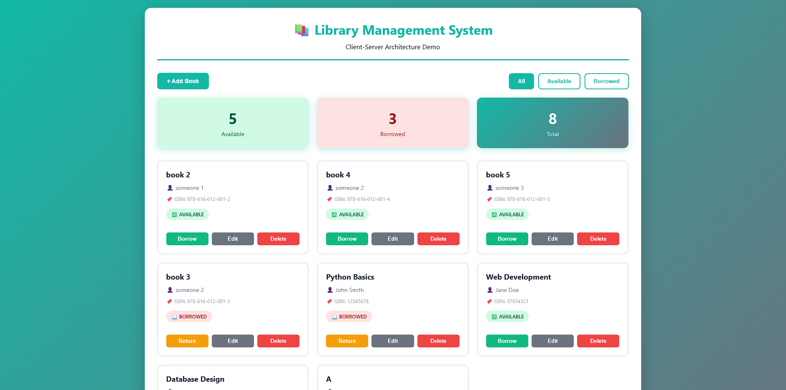
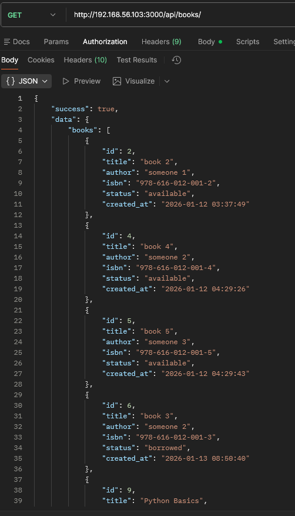
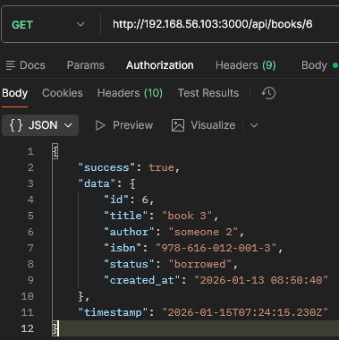
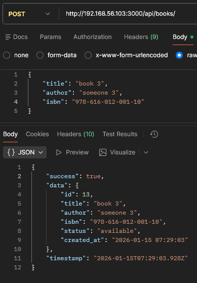
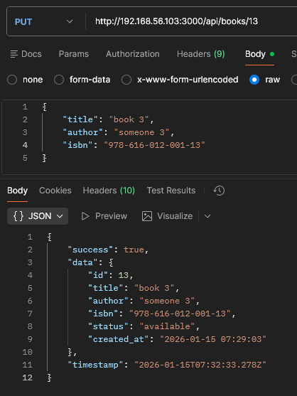
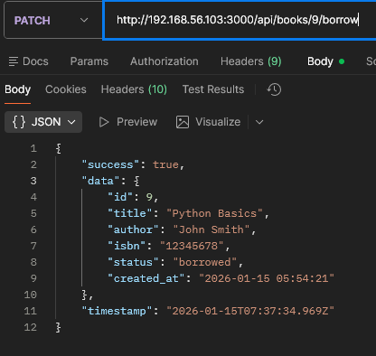
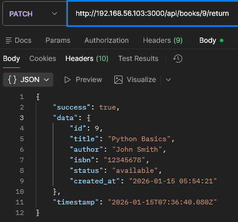
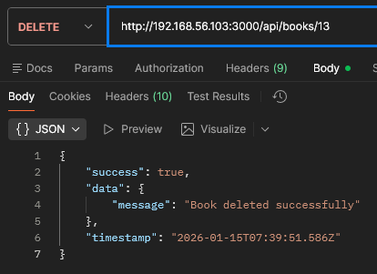

# Library Management System - Client-Server Architecture

## Project Information
- **Student Name:** นายณัฐพงศ์ จินะปัญญา
- **Student ID:** 67543210008-8
- **Course:** ENGSE207 - Bonus Exam

## Architecture

### Before: Layered Architecture
- Single application
- Frontend + Backend ผูกติดกัน

### After: Client-Server Architecture
- **Backend:** REST API (Node.js + Express + SQLite)
- **Frontend:** Web Client (HTML + CSS + JavaScript)
- **Communication:** HTTP/JSON

## Project Structure

```
midterm-bonus-<รหัส>/
├── backend/         # Server (VM)
└── frontend/        # Client (Local)
```

## How to Run

### Backend (Server - VM)
```bash
cd backend
npm install
npm start
# Server: http://192.168.56.103:3000
```

### Frontend (Client - Local)
```bash
cd frontend
# Open index.html in browser
# Or use: python3 -m http.server 8000
```

## API Endpoints

### Base URL
```
http://192.168.56.103:3000/api/books
```

### Available Endpoints

| Method | Endpoint | Description |
|--------|----------|-------------|
| `GET` | `/` | Get all books |
| `GET` | `/:id` | Get book by ID |
| `POST` | `/` | Create a new book |
| `PUT` | `/:id` | Update book (full update) |
| `PATCH` | `/:id/borrow` | Borrow a book |
| `PATCH` | `/:id/return` | Return a borrowed book |
| `DELETE` | `/:id` | Delete a book |

### Request/Response Examples

#### 1. Get All Books
```
GET /api/books
Response: [
  { id: 1, title: "...", author: "...", isbn: "...", available: true },
  ...
]
```

#### 2. Get Book by ID
```
GET /api/books/1
Response: { id: 1, title: "...", author: "...", isbn: "...", available: true }
```

#### 3. Create Book
```
POST /api/books
Body: { title: "...", author: "...", isbn: "..." }
Response: { id: 1, title: "...", ... }
```

#### 4. Update Book
```
PUT /api/books/1
Body: { title: "...", author: "...", isbn: "..." }
Response: { id: 1, title: "...", ... }
```

#### 5. Borrow Book
```
PATCH /api/books/1/borrow
Response: { id: 1, title: "...", available: false }
```

#### 6. Return Book
```
PATCH /api/books/1/return
Response: { id: 1, title: "...", available: true }
```

#### 7. Delete Book
```
DELETE /api/books/1
Response: { message: "Book deleted successfully" }
```

## Screenshots

### WebUI


### PostMan
#### GET /api/books

#### GET /api/books/6

#### POST /api/books

#### PUT /api/books/13

#### PATCH /api/books/9/borrow

#### PATCH /api/books/9/return

#### DELETE /api/books/1
